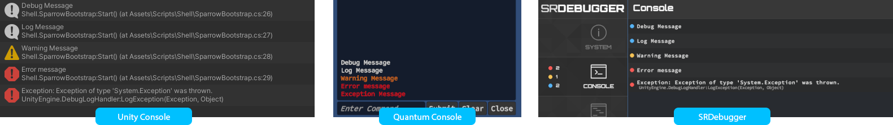
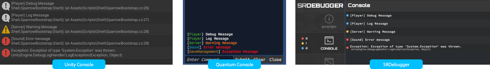

# Chirp - Unity Logging


## Overview
Simple Unity logging framework easily exandable for custom functionality
- Log Channels for easy message categorisation
- Customisable Loggers allow for custom processing
- Default Unity console integration

## Installation
Best way to install Chirp is to download the latest package from [Releases](/releases), full source code is included in the UnityPackage.
Import the package in to your Unity project through `Assets/Import Package/Custom Package`.

## Usage
Chirp Logger hooks up to the default unity `Debug.Log` methods but also allows you to use it's dedicated API.
To start using Chirp, initialise it with the desired Loggers.

> Examples use an additional integration with AssetStore packages: [Quantum Console](https://assetstore.unity.com/packages/tools/utilities/quantum-console-128881), [SRDebugger](https://assetstore.unity.com/packages/tools/gui/srdebugger-console-tools-on-device-27688)

### Initialisation
The framework needs to be enabled for each desired target platform through the settings window. You can find it by opening `Tools/Chirp Framework/Chirp Settings` or by navigating directly to Project Settings window.


Call the initialise method at the beginning of your runtime code.
```csharp
Chirp.Initialise(new UnityConsoleLogger(), new QuantumConsoleLogger());
```

### Logging
The default log API with simple message and stack trace functionality.
```csharp
Chirp.Debug("Debug Message"); // Detailed logs, best for cases like logging rpc responses or method outputs.
Chirp.Log("Log Message"); // Typical log message, most common use case.
Chirp.Info("Info Message"); // State change or any significant message that would have less detailed data.
Chirp.Warning("Warning Message");
Chirp.Error("Error message");
Chirp.Exception(new Exception(), "Exception Message");
```


### Channels
Add Log Channel identifier for specifying the source or context of the log so that it's easily recognisable in console.
```csharp
Chirp.DebugCh("Inventory","Debug Message");
Chirp.LogCh("ConnectionResolver", "Log Message");
Chirp.InfoCh("SaveManager", "Info Message");
Chirp.WarningCh("PlayerController","Warning Message");
Chirp.ErrorCh("SaveManager","Error message");
Chirp.ExceptionCh( "PlayerController", new Exception(), "Exception Message");
```


> Quantum Console needs aditional integration for custom formatting, filtering and Stack Trace lookups.<br/>
> SRDebugger has built in filtering by text.

#### Automatic channels
You can automatically detect channels based on class Types that are found in the stack trace. To tag a type as a LogChannel all you need to do is add the `[LogChannel]` attribute and generate list of channels.
```csharp
[LogChannel]
public class PlayerController
{
  // ...
}
```
After you change which types are tagged with the [LogChannel] attribute, you will need to generate a helper class that will hold the list.
You can find the list generator under `Tools/Chirp Logger/Generate Log Channels List` menu.

## Conditional Compilation
All chirp logging API methods are compiled conditionally and controlled through Player Script Define Symbols.
If Chirp is disabled for given platform any calls to the API will be automatically skipped when compiling - this allows for easy changing of log levels and compiled features without the need to remove your own code.

You can easily adjust the settings through the Chirp Logging Framework Project settings (`Tools/Chirp Logging/Chirp Settings`).

## Integrations
Thanks to it's simple structure Chirp Logging is highly customisable. Most extensions relying on the default Console will work out of the box.

### Quantum Console Integration
I have prepared additional integration with Quantum Console allowing for more detailed information, filtering and search. The full upgrade instructions will be published soon.

## Contributing
If you find any issues or think there are missing features that could benefit the package please use [GitHub Issues](/issues) to report any bugs or ideas.

<p align="right">
  <a href="https://www.twitch.tv/sparrowgamedev">
    
  </a>
  <a href="https://twitter.com/jakubslaby">
    
  </a>
</p>
