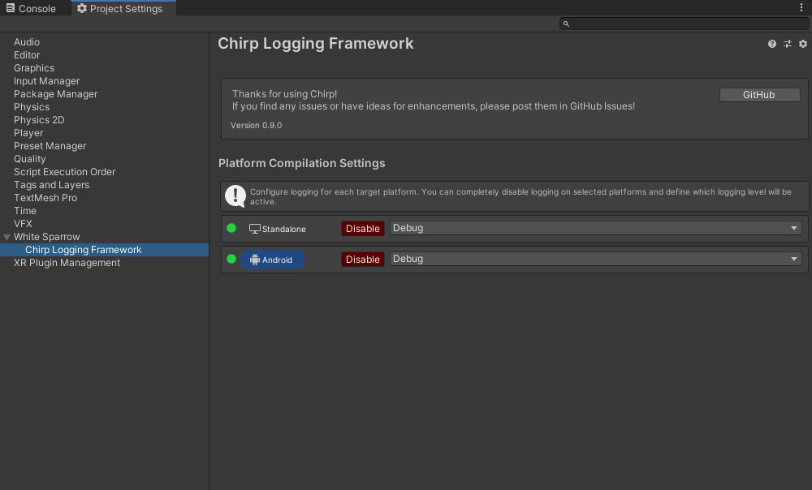

# Chirp - Unity Logging


## Overview
Simple Unity logging framework easily extendable for custom functionality
- Channels (loggers) for easy message categorisation
- Custom outputs for exporting logs to different targets
  - Unity console export for now
- Markdown support for log formatting in Unity Console
- Simplified object property rendering

## Installation
Best way to install Chirp is to download the latest package from [Releases](https://github.com/JakubSlaby/Chirp/releases), full source code is included in the UnityPackage.
Import the package in to your Unity project through `Assets/Import Package/Custom Package`.

## Setup
The framework needs to be enabled for each desired target platform through the settings window. You can find it by opening `Tools/Chirp Framework/Chirp Settings` or by navigating directly to Project Settings window.

## Initialisation through a component
To quickly initialise the logging framework you can create a Chirp Initializer game object in your scene.
Simply go to `Tools/Chirp Logger/Create Initializer Object`.


Enable the available components (by default it comes with UnityConsoleLogger) and enjoy!

### Initialisation From Code
If you don't want to use the Component initialisation method you can register desired outputs from code.
```csharp
public class Bootstrap : MonoBehaviour
{
  private void Awake()
  {
    Chirp.AddOutput<UnityConsoleOutput>();
  }
}
```


```csharp
Chirp.Initialize(new UnityConsoleLogger(), new QuantumConsoleLogger());
```

Or use the `Chirp Initializer` GameObject Component to do that automatically. You can create it through `Tools/Chirp Logger/Create Initializer Object`.

### Logging
The default log API with simple message and stack trace functionality.


## Conditional Compilation
All chirp logging API methods are compiled conditionally and controlled through Player Script Define Symbols.
If Chirp is disabled for given platform any calls to the API will be automatically skipped when compiling - this allows for easy changing of log levels and compiled features without the need to remove your own code.

You can easily adjust the settings through the Chirp Logging Framework Project settings (`Tools/Chirp Logging/Chirp Settings`).


## Integrations
Thanks to it's simple structure Chirp Logging is highly customisable. Most extensions relying on the default Console will work out of the box.

### Quantum Console Integration
I have prepared additional integration with Quantum Console allowing for more detailed information, filtering and search. The full upgrade instructions will be published soon.

## Contributing
If you find any issues or think there are missing features that could benefit the package please use [GitHub Issues](/issues) to report any bugs or ideas.

<p align="right">
  <a href="https://www.twitch.tv/sparrowgamedev">
    
  </a>
  <a href="https://twitter.com/jakubslaby">
    
  </a>
</p>
