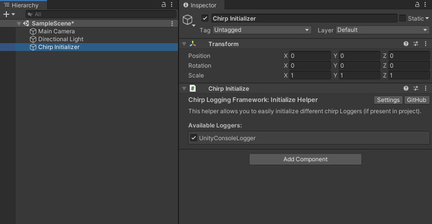

# Chirp - Unity Logging

## Overview
Simple Unity logging framework easily extendable for custom functionality
- Channels (loggers) for easy message categorisation
- Custom outputs for exporting logs to different targets
  - Only Unity console export for now
- Markdown support for log formatting in Unity Console
- Simplified object property rendering

## Installation
Best way to install Chirp is to download the latest package from [Releases](https://github.com/JakubSlaby/Chirp/releases), full source code is included in the UnityPackage.
Import the package in to your Unity project through `Assets/Import Package/Custom Package`.

## Setup
The framework needs to be enabled for each desired target platform through the settings window. You can find it by opening `Tools/Chirp Framework/Chirp Settings` or by navigating directly to Project Settings window.

## Initialisation through a component
To quickly initialise the logging framework you can create a Chirp Initializer game object in your scene.
Simply go to `Tools/White Sparrow/Chirp Logger/Create Initializer Object`.



Enable the available components (by default it comes with UnityConsoleLogger) and enjoy!

### Initialisation From Code
If you don't want to use the Component initialisation method you can register desired outputs from code.
```csharp
public class Bootstrap : MonoBehaviour
{
  private void Awake()
  {
    Chirp.AddOutput<UnityConsoleOutput>();
  }
}
```

Or use the `Chirp Initializer` GameObject Component to do that automatically. You can create it through `Tools/Chirp Logger/Create Initializer Object`.

# Logging
The default log API with simple message and stack trace functionality.

## Default Logger
```csharp
Chirp.Logger.Debug("Simple debug message");
Chirp.Logger.Log("Little more information needed");
Chirp.Logger.Info("Player has started playing a hurdy-gurdy");
Chirp.Logger.Warning("Some NPCs don't like the song player picked");
Chirp.Logger.Error("Player got in to a fight with NPCs over his choice of entertainment");

```

## Custom Channel Loggers
You can create custom channel loggers to provide more context about the context of logs.
```csharp
var barLogger = Chirp.Channels.Create("Bar", Color.cyan);

barLogger.Debug("Simple debug message");
barLogger.Log("Little more information needed");
barLogger.Info("Player has started playing a hurdy-gurdy");
barLogger.Warning("Some NPCs don't like the song player picked");
barLogger.Error("Player got in to a fight with NPCs over his choice of entertainment");
```

Logs from a channel will add the channel name as metadata. In Unity Console logs will be displayed with a prefix
```
[Bar] Player has started playing a hurdy-gurdy
```


### Log Objects
Each log passed through to Chirp is converted to a ChirpLog object which has additional data like timestamp or stack trace added.
You can convert strings in to ChirpLog objects ahead of time as well.

```csharp
var log = "A message in the bottle".AsChirpLog();
```

# Logs with Markdown
Unity Console supports some of the simpler rich text elements, I've added a custom Markdown parser that will allow you to use basic Markdown tags to simplify customised log creation.

```csharp
Chirp.Logger.Log(@"### User Properties
Health: [c:Green]100[/c]
Strength: **20**
Waffles: [c:red]1[/c]
*Health and Strength are important, but so are waffles*".AsChirpLog().AsMarkdown());
```


### Inline Code and Code Block
I've also added simple support for inline code and code block support.

```csharp
Chirp.Logger.Log(@"Simple inline code `can be formatted *without nested markdown execution*`

Code block can prettify json and add a title
```Pretty Json
{""name"":""Edward Teach"",""alias"":""Blackbeard"",""nationality"":""English"",""active_years"":""1716-1718"",""ship"":""Queen Anne's Revenge"",""notoriety"":""Known for his fearsome appearance and ruthless tactics""}
```".AsChirpLog().AsMarkdown());
```


# Logging Objects
You can convert any instanced object to `ChirpLog` and the logger will serialise it as json and display it in a code block.

```csharp
PirateData blackbeard = new PirateData()
{
    Name = "Edward Teach",
    Age = 38,
    Ship = "Queen Anne's Revenge"
};

Chirp.Logger.Log(blackbeard.AsChirpLog());
```


## Conditional Compilation
All chirp logging API methods are compiled conditionally and controlled through Player Script Define Symbols.
If Chirp is disabled for given platform any calls to the API will be automatically skipped when compiling - this allows for easy changing of log levels and compiled features without the need to remove your own code.

You can easily adjust the settings through the Chirp Logging Framework Project settings (`Tools/White Sparrow/Chirp Logger/Chirp Settings`).


## Contributing
If you find any issues or think there are missing features that could benefit the package please use [GitHub Issues](/issues) to report any bugs or ideas.

<p align="right">
  <a href="https://www.twitch.tv/sparrowgamedev">
    
  </a>
  <a href="https://twitter.com/jakubslaby">
    
  </a>
</p>
