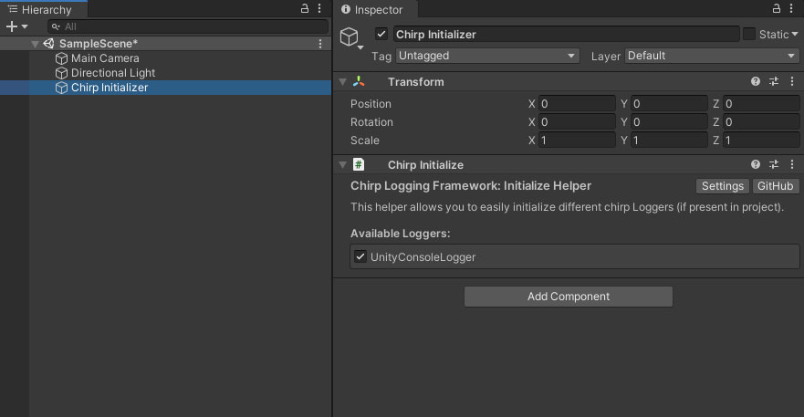

# Chirp Logging Framework
----
You can find Installation more detailed instructions at the github repository webpage https://github.com/JakubSlaby/Chirp/.

## Installation
Put the Chirp source files in Assets/Plugins.

## Initialisation through a component
To quickly initialise the logging framework you can create a Chirp Initializer game object in your scene.
Simply go to `Tools/Chirp Logger/Create Initializer Object`.



Enable the available loggers (by default it comes with UnityConsoleLogger) and enjoy!

## Initialisation from code
First we need to enable Chirp Framework for each desired platform and set the Logging Level.
Navigate to `Tools/Chirp Logger/Chirp Settings` or you can find it in Project Settings window.
In here you will be able to select on which platforms Chirp is enabled and which log level will be set.


To start using Chirp in runtime, initialize the framework by calling `Chirp.Initialize();` and pass desired loggers.
```csharp
Chirp.Initialize(new UnityConsoleLogger());
```

Or use the `Chirp Initializer` GameObject Component to do that automatically. You can create it through `Tools/Chirp Logger/Create Initializer Object`.


## Usage
Default usage:
```csharp
Chirp.Debug("Debug Message"); // Detailed logs, best for cases like logging rpc responses or method outputs.
Chirp.Log("Log Message"); // Typical log message, most common use case.
Chirp.Info("Info Message"); // State change or any significant message that would have less detailed data.
Chirp.Warning("Warning Message");
Chirp.Error("Error message");
Chirp.Exception(new Exception(), "Exception Message");
```

### Channels
Add Log Channel identifier for specifying the source or context of the log so that it's easily recognisable in console.
```csharp
Chirp.DebugCh("Inventory","Debug Message");
Chirp.LogCh("ConnectionResolver", "Log Message");
Chirp.InfoCh("SaveManager", "Info Message");
Chirp.WarningCh("PlayerController","Warning Message");
Chirp.ErrorCh("SaveManager","Error message");
Chirp.ExceptionCh( "PlayerController", new Exception(), "Exception Message");
```

Read more at [GutHub Chirp Repository](https://github.com/JakubSlaby/Chirp/)
